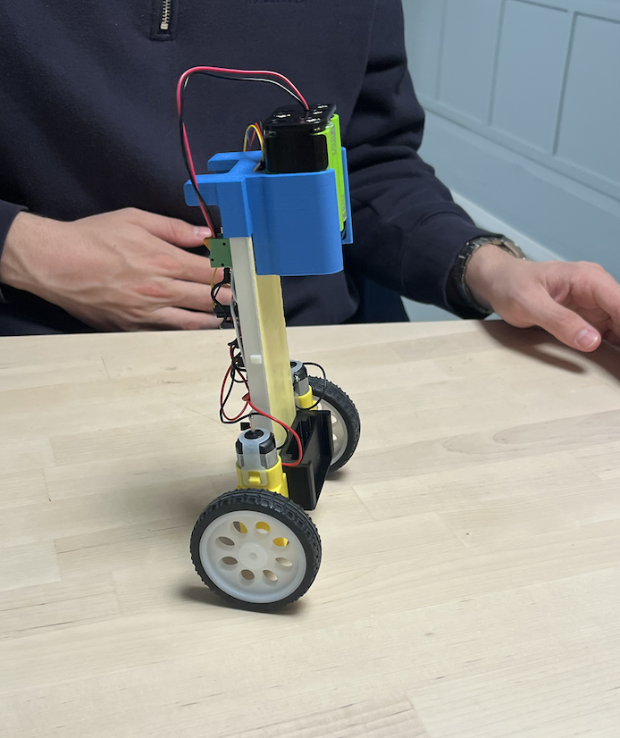

# Self-Balancing Robot

A physical two-wheeled balancing robot developed for **TPK4125 — Mechatronics at NTNU**. The project combines a BMI270 inertial sensor, Mahony attitude estimation, a 100 Hz PID control loop and bidirectional PWM motor actuation.

Developed collaboratively by **Benjamin Færestrand** and **Mohamed Elwalid Fadul**.

## System overview

1. The BMI270 measures angular velocity and acceleration at 100 Hz.
2. An Adafruit Mahony filter estimates the robot's roll angle.
3. QuickPID compares the estimated angle with the upright target.
4. The signed controller output is converted into direction and PWM commands for both motors.
5. Safety logic disables the controller after a large tilt or prolonged actuator saturation.

## Implemented control

- Controller frequency: **100 Hz**
- Upright target: **0° after the installed sensor offset**
- Initial tuning method: **Ziegler–Nichols**
- Ultimate gain: `Ku = 6.5`
- Ultimate period: `Tu = 1.38 s`
- Calculated gains: `Kp = 3.9`, `Ki ≈ 5.65`, `Kd ≈ 0.673`
- Start condition: within ±15° for two seconds
- Shutdown conditions: tilt beyond ±45° or sustained output saturation

These values document the prototype configuration. They are not claimed as universally optimal and should be retuned if the mass distribution, motors, supply voltage or sensor mounting changes.

## Repository structure

| File | Responsibility |
| --- | --- |
| `hovedsketch.ino` | Main setup and real-time task sequence |
| `sensor.ino` | BMI270 setup and Mahony angle estimation |
| `pid.ino` | QuickPID configuration and controller safety logic |
| `motor.ino` | Bidirectional motor direction and PWM output |

## Required libraries

- [QuickPID](https://github.com/Dlloydev/QuickPID)
- [SparkFun BMI270 Arduino Library](https://github.com/sparkfun/SparkFun_BMI270_Arduino_Library)
- [Adafruit AHRS](https://github.com/adafruit/Adafruit_AHRS)

The source uses ESP32-compatible Arduino APIs and explicitly configures I²C on SDA pin 2 and SCL pin 3. Verify every pin against the actual motor driver and microcontroller before applying power.

## Running the prototype

1. Install the three libraries above in the Arduino IDE.
2. Open `hovedsketch.ino` with the remaining `.ino` tabs in the same sketch folder.
3. Select the correct ESP32-compatible board and serial port.
4. Verify the I²C address, motor pins and motor directions against the physical wiring.
5. Upload the sketch, support the robot upright and keep a safe way to disconnect motor power.
6. Retune the controller if the mechanical configuration differs from the documented prototype.

## Limitations and next steps

- No logged response plots or quantitative settling-time measurements are included.
- The controller gains were tuned for one physical configuration.
- Motor dead-zone compensation is fixed rather than identified experimentally.
- A reproducible test protocol should measure disturbance recovery, oscillation and actuator saturation.
- A future revision should add battery/current monitoring and a dedicated hardware motor-disable path.

## Academic context

This repository documents a student prototype and its control implementation. It is intended as engineering portfolio evidence, not as a production-ready robotics controller.
